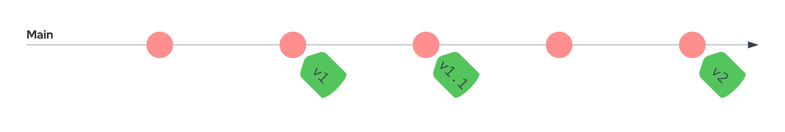

# Tailspin Space Game project environment

A working example GitOps workflow for a Kubernetes cluster.

## Getting started

The environment follows a single branch workflow for the development cluster, production tracks tags.


A merge request can be introduced before tagging if required. Development and Production will apply upgrades automatically.

To apply across an OpenShift cluster, use the `oc` command.

```
oc apply -f development-application-environment.yaml

oc apply -f production-application-environment.yaml
```

OpenShift-gitOps must be installed in the cluster. A manifest has been provided in [Doc/OpenShift](doc/OpenShift).

## Uninstallation
To remove either environment from an OpenShift cluster, first remove the `Application` spec, followed by the `Namespace`.

```
# Remove the development App and Namespace.

oc delete application/tail-spin-development
oc delete namespace/tail-spin-development
```